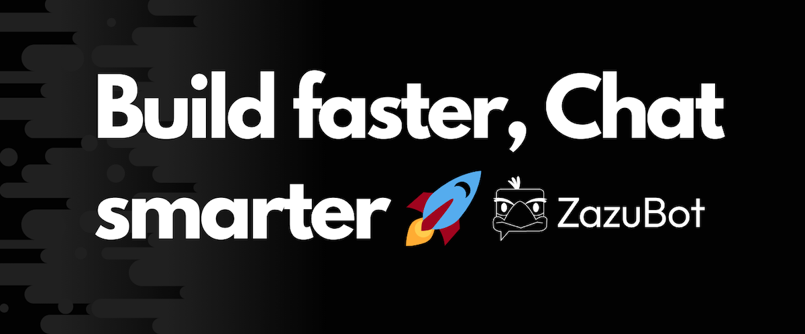

 

 

ZazuBot is a platform that enables you to effortlessly create and integrate advanced chatbots into websites and chat platforms like WhatsApp..

<h3 align="center">
  <b><a href="https://app.zazubot.com/register">Try Typebot</a></b>
  •
  <b><a href="https://docs.zazubot.com/">Docs</a></b>

---

## Features

Typebot makes it easy to create advanced chatbots. It provides the building block that are adaptable to any business use case. I improve Typebot regularly with bug fixes, new features, and performance improvements regularly.

**Chat builder** with 34+ building blocks such as:

- 💬 Bubbles: Text, Image / GIF, video, audio, embed.
- 🔤 Inputs: Text, email, phone number, buttons, picture choice, date picker, payment (Stripe), file picker... inputs
- 🧠 Logic: Conditional branching, URL redirections, scripting (Javascript), A/B testing
- 🔌 Integrations: Webhook / HTTP requests, OpenAI, Google Sheets, Google Analytics, Meta Pixel, Zapier, Make.com, Chatwoot, More to come...

**Theme** your chatbot to match your brand identity:

- 🎨 Customize the fonts, background, colors, roundness, shadows, and more
- 💪 Advanced theming with custom CSS.
- 💾 Reusable theme templates

**Share** your typebot anywhere:

- 🔗 Custom domain
- 👨‍💻 Embed as a container, popup, or chat bubble easily with the native JS library.
- ⚡ Blazing fast embed lib. No iframe, no external dependencies, no performance impact.
- 💻 Executable with HTTP requests

Collect your **Results** and get insights:

- 📊 In-depth analytics with drop-off rates, completion rates, and more
- 📥 Export results to CSV

Built for **developers**:

- 🔓 No vendor-locking. Features built with flexibility in mind.
- 💻 Easy-to-use [APIs](https://docs.zazubot.com/api-reference).

## Getting started with Typebot

The easiest way to get started with Typebot is with [the official managed service in the Cloud](https://app.zazubot.com). You'll have high availability, backups, security, and maintenance all managed for you by me, [Baptiste, Typebot's founder](https://twitter.com/baptisteArno).

The cloud version can save a substantial amount of developer time and resources. For most sites this ends up being the best value option and the revenue goes to funding the maintenance and further development of Typebot.
So you’ll be supporting fair source software and getting a great service! 💙

## Support & Community

You'll find a lot of resources to help you get started with Typebot in the [documentation](https://docs.zazubot.com/).

- Have a question? Join the [Discord server](https://zazubot.com/discord) and get instant help.
- Found a bug? [Create an issue](https://github.com/baptisteArno/typebot.io/issues/new)

## Self-hosting

Interested in self-hosting Typebot on your server? Take a look at the [self-hosting installation instructions](https://docs.zazubot.com/self-hosting/get-started).

## How to Contribute

You are awesome, lets build great software together. Head over to the [Contribute docs](https://docs.zazubot.com/contribute/overview) to get started. 💪

## Run the project locally

Follow the [Local installation](https://docs.zazubot.com/contribute/guides/local-installation) section of in the Contributing docs.

### Top contributors

Made with [contrib.rocks](https://contrib.rocks).

## License

Typebot's code is protected under a Functional Source License. You will find more information about the license and how to comply with it [here](https://docs.zazubot.com/self-hosting#license-requirements).
